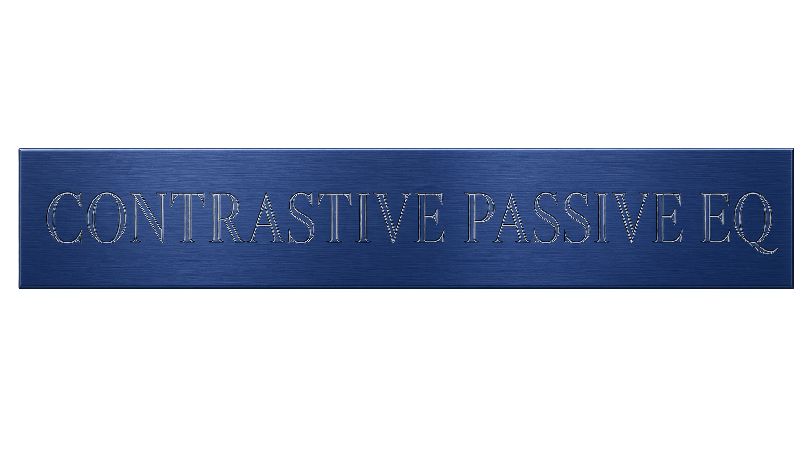

Contrastive Passive EQ is a passive, four-band, stereo mastering equaliser, built as a VST3 plugin with no GUI of its own (hosts show their generic controls) and meant to be driven from code (for example from Spotify's Pedalboard in Python). Prebuilt downloads are for Linux; it builds from the same source on macOS and Windows (see Build).
It is modelled on the published curves of the Manley Massive Passive (Mastering version).
It is a behavioural model of the passive network, fitted to the response curves printed in that unit's owner's manual, and not a circuit clone.
Contrastive Passive EQ is not affiliated with or endorsed by Manley Laboratories.

## What makes it different

- **The bands sit in one passive divider, so boosts combine instead of stacking.** Every boosting band is a branch in one shared divider and every cutting band a branch in a second one, so the bands interact the way a parallel passive EQ does rather than adding in dB. Four bands at the top step near 1 kHz give 19.9 dB, not 44 dB.
- **The shelves carry their own contrasting dip.** In shelf mode the band's own bell moves into the opposite divider. Turning BANDWIDTH clockwise brings in a dip at the switch frequency under a boosting shelf (a bump under a cutting one), so the shelf rises past a notch; counter-clockwise gives a plain shelf. The 16K and 27K shelves tune their dip to about 8 kHz (the response minimum falls near 6.8 kHz) and carry a 50 kHz low pass inside the shelf branch. The 22 Hz and 33 Hz shelves turn into a resonant, high-passed shelf as BANDWIDTH goes clockwise.
- **Minimum phase, zero latency.** Each setting's analog zeros and poles are mapped exactly with the matched z-transform, and a 64-tap minimum-phase FIR corrects the remaining magnitude error near Nyquist. Nothing looks ahead and nothing is oversampled: the plugin reports 0 samples of latency and its impulse response starts and peaks at sample 0.
- **Every front-panel control, stepped like the hardware, for both channels plus LINK.** Per channel: four bands (BOOST / OUT / CUT, SHELF / BELL, 16 gain detents, 16 bandwidth detents, 11 frequencies), IN, output gain trim, low pass and high pass; then LINK and POWER. That is 50 automatable parameters, each showing the panel's own legends.



## Install

Download `ContrastivePassive-1.0.0-linux-x86_64.zip` (or `-linux-aarch64.zip`) and `SHA256SUMS` from the repository's Releases page, then:

```bash
sudo apt-get install -y unzip        # minimal images lack it
sha256sum --ignore-missing -c SHA256SUMS
mkdir -p ~/.vst3
unzip -o ContrastivePassive-1.0.0-linux-x86_64.zip -d ~/.vst3
```

That gives `~/.vst3/ContrastivePassive.vst3`, which VST3 hosts on Linux find by themselves. Unzipping both zips there gives one bundle for both architectures. The bundle carries `LICENSE` and `THIRD_PARTY_NOTICES.md` in `Contents/Resources/`.

The prebuilt binaries were built on Debian 12 and need glibc 2.35 or newer and libstdc++ from GCC 5 or newer (Debian 12, Ubuntu 22.04 and later). Formats: VST3 only, Linux, `x86_64` and `aarch64`, stereo in and out.

## Build

On Debian 12 (bookworm):

```bash
sudo apt-get update
sudo apt-get install -y build-essential pkg-config git ca-certificates
git clone https://github.com/brookcs3/contrastive-passive-eq.git
cd contrastive-passive-eq
scripts/build.sh
```

`scripts/build.sh` clones the plugin framework, [DPF](https://github.com/DISTRHO/DPF), at the pinned commit `4238e1c7f0351bbe488d79f0899c540543ac7583` into `third_party/DPF`, builds and runs the DSP unit tests (a failing test stops the build), and builds the plugin: `build/bin/ContrastivePassive.vst3/Contents/<arch>-linux/ContrastivePassive.so`. No Steinberg SDK and no JUCE are involved. To use your own build from Python, copy it where the examples below look: `mkdir -p ~/.vst3 && cp -r build/bin/ContrastivePassive.vst3 ~/.vst3/`.

The same build in throwaway `debian:12` containers, for one or both architectures (the other one runs under emulation: on a Linux host that needs QEMU user emulation registered with binfmt, for example `docker run --privileged --rm tonistiigi/binfmt --install all`), then the release zips:

```bash
scripts/docker-build.sh aarch64 x86_64    # both land in build/bin/ContrastivePassive.vst3
python3 scripts/package.py                # dist/ContrastivePassive-1.0.0-linux-<arch>.zip and dist/SHA256SUMS
```

A clean build this way reproduces the release binaries bit for bit on both architectures (checked with `debian:12` and `debian:12-slim`, DPF freshly cloned). The release zips were packaged with `SOURCE_DATE_EPOCH=1790477659`; set it to reproduce the zips byte for byte. Keep the `-fno-fast-math` in `src/Makefile`: the eigenvalue iteration relies on IEEE arithmetic.

### macOS (build from source)

Tested on macOS 27 with Xcode's command line tools; this builds one bundle for Apple Silicon and Intel:

```bash
xcode-select --install                    # Apple's command line tools, if not installed
git clone https://github.com/brookcs3/contrastive-passive-eq.git
cd contrastive-passive-eq
git clone https://github.com/DISTRHO/DPF.git third_party/DPF
git -C third_party/DPF checkout 4238e1c7f0351bbe488d79f0899c540543ac7583
CFLAGS="-arch arm64 -arch x86_64" CXXFLAGS="-arch arm64 -arch x86_64" LDFLAGS="-arch arm64 -arch x86_64" make -C src
codesign --force --deep --sign - build/bin/ContrastivePassive.vst3   # ad-hoc signature, needed on Apple Silicon
mkdir -p ~/Library/Audio/Plug-Ins/VST3
cp -R build/bin/ContrastivePassive.vst3 ~/Library/Audio/Plug-Ins/VST3/
```

Leave out the three `-arch` variables for a build for this Mac's own architecture only. This gives a VST3, which hosts such as Reaper, Ableton Live, Bitwig and Pedalboard load; Logic Pro loads Audio Units only, so it will not see the VST3.

### Windows (build from source)

Not yet tested on Windows. The same source builds with MinGW-w64 through DPF. In an MSYS2 "MINGW64" shell ([msys2.org](https://www.msys2.org)):

```bash
pacman -S --needed git make mingw-w64-x86_64-gcc mingw-w64-x86_64-pkgconf
git clone https://github.com/brookcs3/contrastive-passive-eq.git
cd contrastive-passive-eq
git clone https://github.com/DISTRHO/DPF.git third_party/DPF
git -C third_party/DPF checkout 4238e1c7f0351bbe488d79f0899c540543ac7583
make -C src
cp -r build/bin/ContrastivePassive.vst3 "/c/Program Files/Common Files/VST3/"
```

Copying into `Program Files` needs an administrator shell.

## Use it from Python with Pedalboard

```bash
sudo apt-get install -y python3-venv libatomic1    # Pedalboard's Linux wheel needs libatomic, which minimal Debian images lack
python3 -m venv .venv && . .venv/bin/activate
pip install pedalboard==0.9.23
```

Pass the outer `.vst3` folder, not the binary inside it. The examples use the Linux install path; on macOS use `~/Library/Audio/Plug-Ins/VST3/ContrastivePassive.vst3` (Pedalboard runs on macOS too), on Windows `C:\Program Files\Common Files\VST3\ContrastivePassive.vst3`. Pedalboard lowercases the parameter names (the plugin declares `L_band3_mode`; Python sees `l_band3_mode`). Every value must be one of the parameter's positions: `eq.parameters["l_band3_freq_hz"].valid_values` lists them.

```python
import os
import numpy as np
from pedalboard import load_plugin
from pedalboard.io import AudioFile

eq = load_plugin(os.path.expanduser("~/.vst3/ContrastivePassive.vst3"))   # the outer .vst3 folder
print(eq.name, len(eq.parameters))       # Contrastive Passive EQ 50

eq.link = True                           # the right channel follows every l_ control
eq.l_band3_mode = "BOOST"                # "BOOST", "OUT" or "CUT"
eq.l_band3_type = "BELL"                 # "SHELF" or "BELL"
eq.l_band3_freq_hz = 3300                # one of the band's eleven switch frequencies
eq.l_band3_bandwidth = 7                 # 0 (widest) .. 15 (narrowest)
eq.l_band3_gain_step = 4                 # 0 (flat) .. 15 (top detent)
eq.l_highpass = "30"                     # "OFF" "12" "16" "23" "30" "39"
eq.l_gain_db = -0.5                      # output trim, -2.5 .. +2.5 in 0.5 dB steps

with AudioFile("mix.wav") as f:
    audio, sr = f.read(f.frames), f.samplerate   # float32, shape (channels, samples)
out = eq(audio, sr)                              # same length, zero latency
with AudioFile("mix_eq.wav", "w", sr, out.shape[0], bit_depth=24) as f:
    f.write(out)
```

That setting peaks at 3.3 kHz, +3.6 dB before the -0.5 dB trim, with the 30 Hz high pass 3 dB down at 30 Hz.

To EQ the mid only, encode to mid/side and run the mid through the left channel. A fresh instance leaves the right channel flat (every band OUT, LINK off), so the side comes back bit for bit:

```python
ms = load_plugin(os.path.expanduser("~/.vst3/ContrastivePassive.vst3"))
ms.l_band4_mode = "BOOST"                # a touch of 16K air on the mid
ms.l_band4_type = "SHELF"
ms.l_band4_freq_hz = 16000
ms.l_band4_bandwidth = 0
ms.l_band4_gain_step = 3

mid, side = (audio[0] + audio[1]) / 2, (audio[0] - audio[1]) / 2
mid_eq, side_out = ms(np.stack([mid, side]), sr)
out_ms = np.stack([mid_eq + side_out, mid_eq - side_out])   # back to left/right
```

Both examples are run as written by `tests/readme_examples.py`. Notes for scripted use:

- **Saving state:** process at least one buffer after changing parameters before reading `eq.raw_state`. Read earlier, it still holds the previous values (DPF saves the processor's copy). After one buffer, save and restore into a fresh instance is exact.
- **Changes while playing:** every change designs the new filter, warms it up on the last 80 ms of input and crossfades over 15 ms, so automation is click-free; a change that arrives during a fade is applied when the fade ends. With `reset=True` (Pedalboard's default) a render starts exactly on the current settings, bit-identical to a fresh instance; with `reset=False` a change crossfades from the previous setting, as it would while playing.
- **Teardown:** DPF may print `asked to delete component while audio processor still active` when Python exits. It is harmless.

## Parameters

50 parameters: 24 per channel (prefix `l_` or `r_`), then `link` and `power`. Bands are numbered left to right on the panel. Every parameter is stepped and automatable.

| panel control | parameter (per channel) | positions |
|---|---|---|
| BOOST / OUT / CUT toggle | `l_band<n>_mode` | `"BOOST"`, `"OUT"` (the band's hard bypass), `"CUT"` |
| SHELF / BELL switch | `l_band<n>_type` | `"SHELF"`, `"BELL"` (bands 1 and 2 are low shelves, bands 3 and 4 high shelves) |
| dB knob | `l_band<n>_gain_step` | 0 (fully counter-clockwise, flat) to 15 (fully clockwise): 16 detents |
| BANDWIDTH knob | `l_band<n>_bandwidth` | 0 (fully counter-clockwise, widest) to 15 (fully clockwise, narrowest): 16 detents |
| FREQUENCY, band 1 | `l_band1_freq_hz` | 22 33 47 68 100 150 220 330 470 680 1000 |
| FREQUENCY, band 2 | `l_band2_freq_hz` | 82 120 180 270 390 560 820 1200 1800 2700 3900 |
| FREQUENCY, band 3 | `l_band3_freq_hz` | 220 330 470 680 1000 1500 2200 3300 4700 6800 10000 |
| FREQUENCY, band 4 | `l_band4_freq_hz` | 560 820 1200 1800 2700 3900 5600 8200 12000 16000 27000 |
| IN switch | `l_in` | `True`; `False` bypasses the channel's bands, filters and trim |
| output GAIN trim | `l_gain_db` | -2.5 to +2.5 in 0.5 dB steps (11 positions) |
| LOW PASS | `l_lowpass` | `"OFF"` `"52K"` `"40K"` `"27K"` `"20K"` `"15K"` (18 dB/octave; 52K is 30 dB/octave) |
| HIGH PASS | `l_highpass` | `"OFF"` `"12"` `"16"` `"23"` `"30"` `"39"` (Hz, 18 dB/octave) |
| LINK (global) | `link` | `True`: the right channel uses every left-channel control; the `r_` values are kept but ignored |
| POWER (global) | `power` | `False` is a global bypass (the hardware would pass no audio when off) |

Defaults: every band `OUT`, `BELL`, gain step 0, bandwidth 7, the sixth frequency position; IN on, trim 0, filters off, LINK off, POWER on. The default state, gain step 0 on any band, `OUT`, IN off and POWER off are all bit-transparent. The filters are third-order Chebyshev type I (fifth-order for 52K) with 0.14 dB ripple, -3 dB at the switch frequency.

**What a gain step is worth.** There is no fixed dB per detent: the amount depends on the bandwidth, as on the original. Band 3, peak (or plateau) level in dB:

| step | 0 | 1 | 2 | 3 | 4 | 5 | 6 | 7 | 8 | 9 | 10 | 11 | 12 | 13 | 14 | 15 |
|---|---|---|---|---|---|---|---|---|---|---|---|---|---|---|---|---|
| bell boost, bandwidth 15 (narrow) | 0.0 | +2.7 | +3.4 | +4.0 | +4.6 | +5.2 | +5.9 | +6.5 | +7.1 | +7.8 | +8.4 | +9.0 | +9.6 | +10.1 | +10.6 | +11.0 |
| bell boost, bandwidth 7 | 0.0 | +1.9 | +2.6 | +3.1 | +3.6 | +4.1 | +4.6 | +5.1 | +5.5 | +6.0 | +6.4 | +6.8 | +7.1 | +7.4 | +7.7 | +7.9 |
| bell boost, bandwidth 0 (wide) | 0.0 | +1.0 | +1.6 | +2.0 | +2.4 | +2.7 | +3.0 | +3.3 | +3.6 | +3.8 | +4.0 | +4.2 | +4.3 | +4.5 | +4.6 | +4.7 |
| bell cut, bandwidth 15 | 0.0 | -2.4 | -3.0 | -3.5 | -4.1 | -4.6 | -5.2 | -5.8 | -6.5 | -7.1 | -7.7 | -8.3 | -8.9 | -9.4 | -9.9 | -10.4 |
| bell cut, bandwidth 0 | 0.0 | -0.9 | -1.3 | -1.7 | -2.0 | -2.3 | -2.6 | -2.8 | -3.1 | -3.3 | -3.5 | -3.6 | -3.8 | -3.9 | -4.0 | -4.1 |
| high shelf boost, bandwidth 0 | 0.0 | +2.8 | +3.4 | +4.0 | +4.6 | +5.2 | +5.8 | +6.5 | +7.1 | +7.8 | +8.4 | +9.0 | +9.6 | +10.1 | +10.6 | +11.0 |

The shelf row is the shelf's full plateau (measured at the 220 Hz switch position). A shelf at a higher switch frequency is still rising at 20 kHz, so it reaches less inside the audio band: at the top step about +9.1 dB (4.7 kHz shelf) and +8.5 dB (10 kHz shelf) by 20 kHz.

## Verification in numbers

Measured on the release binaries, on both `x86_64` and `aarch64`, through Pedalboard 0.9.23:

- **It matches its own analog network to within a few thousandths of a dB.** The repository's own tests (`scripts/test.sh`) render 1,658 channel responses at 48 to 192 kHz, 20 Hz to 20 kHz, with a worst magnitude error of 0.0012 dB. In development testing over a broader 502-setting grid (every band alone in each mode, bandwidth, gain and frequency class, every filter, 60 random settings) the largest error was 0.0034 dB at 44.1 kHz, 0.0015 dB at 48 kHz and 0.0004 dB at 96 kHz, with the phase within 0.104 degree of the minimum-phase response of that magnitude.
- **204 of 204 control checks pass:** every position of every control on both channels reads back and does what its legend says, all 16 gain and bandwidth detents are live and monotonic, every bell peaks within 2 % of its switch frequency, the trims are exact to 0.001 dB, the filters are -3 dB within 3 % of nominal, LINK and channel independence hold, and the bypasses null bit for bit against the input.
- **Zero latency:** reported latency 0; the impulse response starts and peaks at sample 0.
- **About 280 times real time** on one `aarch64` core for stereo audio with every band and both filters engaged, and about 130 times with a control change every 100 ms (each change designs the new filter inside the audio callback, about 0.4 ms on average in `tests/pb_bench.py`).
- **Also:** stable at every extreme setting from 8 kHz to 192 kHz; the DSP unit tests put the digital design within 0.0035 dB of the analog network at 44.1 kHz and 0.0002 dB at 96 kHz over 1,500 random settings per rate; the network's constants are fitted to a subset of the 37 response curves digitised from the owner's manual and validated on 33 of them, with rms errors of 0.028 to 0.23 dB for the bells and shelves at the printed positions (0.19 to 0.64 dB on a second printed run of the 100 Hz shelves, which itself sits up to 0.7 dB off the first).

Run the tests yourself: `scripts/build.sh` runs the unit tests, and `scripts/test.sh` runs the cross-check against the Python reference model and the Pedalboard tests on the built bundle (in a venv with `pip install -r tests/requirements.txt`, which pins Pedalboard 0.9.23, numpy 2.2.6 and scipy 1.15.3). `scripts/docker-test.sh` does the same in a throwaway `debian:12` container.

## Limits

- **Gain steps below the printed curves are extrapolated.** The manual prints curves only at full gain and at the knob's 12:00, which step 10 reaches here. Steps 1 to 9 come from the fitted gain law, so the first detent jumps to +2.7 dB on a narrow bell (+1.0 dB on a wide one) and there is no band move smaller than about 1 dB; use the output trim for half-dB level moves. No shelf is printed below full gain either.
- **The top cut is about -10.4 dB** (narrow bell, step 15), against the 11 dB the specification gives for boost or cut. The top boost is +11.0 dB.
- **LINK is taken from a panel image.** The switch is on the modelled panel but neither owner's manual describes it. Here it copies the left controls to the right channel, and automation on the `r_` parameters does nothing while it is on.
- **Not a circuit clone.** The network's form (two dividers carrying series R-L-C, R-C and R-L branches) is behavioural, built from the manual's description of the signal flow and fitted to its printed curves; no schematic is published. It is linear: no tube, transformer or inductor non-linearity and no noise. IN off and POWER off are bit-transparent bypasses, while the hardware keeps its amplifiers in circuit and passes no audio when powered off.
- **Inferred details:** 16 BANDWIDTH detents (only the gain detent count is documented, and 12:00 falls between steps 7 and 8); the spacing of the detents along each pot; the filter shape (fitted to the flattest printed high passes of the non-mastering unit); the 16K/27K voicing, taken from the manual's text; bands 2 to 4 use band 1's bell shape, which is what the only printed band-3 bell supports.
- **Phase:** the plugin is exactly minimum phase for its own magnitude. The analog network's phase also depends on its response above Nyquist, so the two part near the top of the band: at 44.1 kHz with bands only, at most about 9 degrees below 5 kHz (median 0.6 degree) and up to about 45 degrees near 20 kHz (the 27K shelf turned fully clockwise); about 37 degrees at 48 kHz and 10 at 96 kHz. With a low pass engaged the difference is larger near its corner. The magnitude is unaffected.
- **Live hosts:** each control change designs the new filter inside the audio callback (about 0.4 ms on average, with occasional spikes near 1 ms), so fast automation at buffers of 64 samples or fewer could overrun a callback. Offline rendering is unaffected.

## Repository layout

| path | what it is |
|---|---|
| `src/PluginContrastivePassive.cpp`, `src/ContrastivePassiveParams.hpp`, `src/DistrhoPluginInfo.h`, `src/Makefile` | the DPF plugin: the 50 parameters, LINK and POWER, one engine per channel |
| `src/dsp/Network.hpp`, `src/dsp/FittedConstants.hpp` | the passive network: panel positions to branch admittances, dividers, filters, analog zeros, poles and gain; the fitted constants |
| `src/dsp/EigenReal.hpp` | allocation-free real eigenvalue solver, a C++ translation of JAMA's public-domain `orthes` and `hqr2` |
| `src/dsp/Design.hpp`, `src/dsp/Engine.hpp` | pairing, matched z-transform and FIR correction; the real-time cascade, warm-up and crossfades |
| `src/third_party/pocketfft/` | the FFT (BSD-3-Clause), vendored with its licence and a note of its one local change |
| `tests/` | `test_dsp.cpp` (C++ unit tests), `ref_model.py` (the network in Python), `crosscheck.py`, `pb_load.py`, `pb_ir_test.py`, `pb_coverage.py`, `readme_examples.py`, `pb_bench.py` |
| `scripts/` | `build.sh`, `docker-build.sh`, `test.sh`, `docker-test.sh`, `package.py` |

The manual, its curves and the fitting data are not part of this repository.

## Credits

- [DPF](https://github.com/DISTRHO/DPF), the DISTRHO Plugin Framework, by Filipe Coelho (ISC).
- [pocketfft](https://github.com/mreineck/pocketfft), the header-only C++ FFT by Martin Reinecke and Peter Bell, Max-Planck-Society (BSD-3-Clause).
- [JAMA](https://math.nist.gov/javanumerics/jama/), the Java Matrix Package by The MathWorks and NIST (public domain), whose eigenvalue routines `src/dsp/EigenReal.hpp` translates.
- [Pedalboard](https://github.com/spotify/pedalboard) by Spotify (GPL-3.0), the host the tests run in.
- VST is a registered trademark of Steinberg Media Technologies GmbH.

The full notices are in `THIRD_PARTY_NOTICES.md`.

## Licence

GPL-3.0-only: see `LICENSE`. The third-party parts keep their own licences (ISC, BSD-3-Clause, public domain), listed with their notices in `THIRD_PARTY_NOTICES.md`.

The logo images in `docs/` (`logo_wordmark.png`, `logo_plate.png`) are copyright Cameron Brooks, all rights reserved. They are not covered by the GPL and may not be reused without permission.

## Author

Cameron Brooks (brookcs3)
